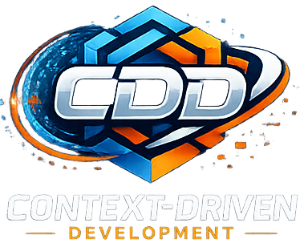

  

# Context-Driven Development

**Control the context. Control the outcome.**

Context-Driven Development, or CDD, is a method for governing software outcomes through structured context, validated execution, and feedback.

CDD starts from a simple premise:

> Prompting is not the system. Context is the system.

## What CDD is

CDD treats delivery as a governed flow:

`Context -> Response -> Validation -> Improved Context`

In practice, that means:

- work begins from deliberately assembled context, not ad hoc prompting
- stages define what context they require and what outputs they are allowed to produce
- outputs are validated before they become future truth
- successful patterns are fed back into the system as reusable capability

CDD is designed to make software work more understandable, repeatable, and auditable across humans, AI systems, and deterministic generators.

## Why it exists

Most software work is already context-driven, whether teams name it that way or not.

- a brief becomes context for planning
- a plan becomes context for design
- a design becomes context for implementation
- an implementation becomes context for validation and future work

When that flow is accidental, teams get drift, rework, and fragile output quality. When that flow is explicit, structured, and validated, outcomes become more controllable.

## Core loop

CDD's basic loop is:

`Context Assembly -> Guided Execution -> Validated Output -> Context Improvement`

The broader operating model extends that into:

`Context Delta -> Plan Selection -> Context Assembly -> Plan Validation -> Task Emission -> Execution -> Output Validation -> Context Update -> History / Generalization`

## Two kinds of execution

CDD distinguishes between two important execution modes.

### Probabilistic execution

Used where interpretation, synthesis, or design is required.

Examples:

- planning
- architecture work
- service design
- workflow design
- AI-assisted authoring

Here, context shapes the probability distribution of the result.

### Deterministic execution

Used where the transformation should be strict and repeatable.

Examples:

- code generation
- schema-driven scaffolding
- templated transformations
- repeatable boilerplate production

Here, context constrains the output directly rather than guiding interpretation.

## What makes CDD different

- Context is the control surface, not the prompt.
- Plans are responses to context, not free-floating work items.
- Tasks are emitted from validated plans, not treated as the source of truth.
- Outputs do not become future truth until they are validated.
- Provenance matters because teams need to know what shaped a result.
- Generalization is governed so repeated success can become reusable capability.

## Who this is for

CDD is relevant to:

- software teams using AI-assisted workflows
- teams building generators, templates, and shared platforms
- architects trying to make design intent durable
- engineering leaders who want better traceability between intent and delivery
- researchers exploring structured collaboration between humans and machines

## In this repository

- [MANIFESTO.md](./MANIFESTO.md) explains the philosophy and doctrine
- [CONTEXT_MODEL.md](./CONTEXT_MODEL.md) defines the operating model
- [GLOSSARY.md](./GLOSSARY.md) defines the core terms
- [FAQ.md](./FAQ.md) answers common questions
- [ROADMAP.md](./ROADMAP.md) describes the public direction
- [examples/README.md](./examples/README.md) contains lightweight conceptual examples

## Public-safe examples

### Same prompt, different context

Ask two systems to design a billing service.

- one receives only: "Design a billing service"
- the other receives domain rules, failure modes, naming conventions, compliance constraints, and prior validated patterns

The prompt is similar. The context is not. The second result is more predictable because the system had stronger constraints and better governing information.

### Minimal stage flow

1. collect the relevant context
2. qualify whether that context is sufficient
3. perform the stage
4. validate the output
5. decide what should become future context

### Context bundle to validated output

A team wants to add a customer onboarding workflow.

- the context bundle includes business goals, workflow constraints, existing domain language, and prior output examples
- execution produces a workflow design and an implementation proposal
- validation checks alignment, completeness, and convention fit
- approved outputs become reusable context for later work

## Current status

This is the first public, docs-first release of CDD.

The goal of this release is clarity, not tooling completeness. Public reference examples and open tooling may follow, but the methodology comes first.

## Position

CDD is a methodology first.

Reference stacks, tools, and editor experiences can help express it, but they are not required to understand the method. This repository is intentionally focused on the portable theory layer.

## License

This repository is licensed under the GNU Affero General Public License v3.0. See [LICENSE](./LICENSE).
